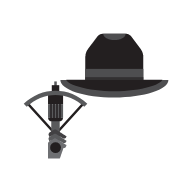

# Winter Bash 2019 Hats

Every known [Stack Exchange Winter Bash 2019](https://winterbash2019.stackexchange.com/) hat preserved in their original SVG format.

## Notes

These hats were made by [Stack Exchange](https://stackexchange.com), and the license for reusing them is unknown.

## Public Hats

### Scarf Ace

> earn the Guru badge

> earn the Guru badge

### Glasses With A Number On Top

> starred chat, ±12h from Jan 1, 0:00 UTC

> post a message in chat within ±12 hours of the UTC New Year’s begin that gets starred

### Just Jesting

> 10 upvoted comments

> post 10 comments that each earn an upvote

### The Milliner

> collect 11 hats

> collect 11 hats

### Hero Of Time

> ask at 7pm anywhere

> ask a question when it is 7:00 pm in any time zone

### Werewolf Hunter

> edit 3 old questions on any site

> edited 3 questions on any site that were posted more than a year ago

### Rep Hunter

> 5 accepted answers in 1 day

> post 5 answers that get accepted, all posted in a single UTC day or all accepted in a single UTC day

### Cosmic Brain

> earn the Nice Answer badge

> earn the Nice Answer badge

### Fashionable

> 9000 views of your questions

> get over 9,000 combined total views on all questions that you asked during Winter Bash

### Red Baron

> answer question at -3, becomes +3 and answer +5

> answer a question scoring -3 or lower; the question eventually becomes 3+ and your answer becomes 5+

### Foot of the Rainbow

> earn a gold badge on any site

> earn a gold badge on either a meta or a main site

### Where in the World?

> post or vote on Dec 21

> ask, answer, or vote when it’s December 21st anywhere in the world (this hat comes in two forms, but you can only get one)

### Where in the World?

> post or vote on Dec 21

> ask, answer, or vote when it’s December 21st anywhere in the world (this hat comes in two forms, but you can only get one)

### Snaphat

> answer in 30 min, +3 and accepted

> answer within 30 minutes of the question being asked, scoring 3 and getting accepted

### Philantropist

> award bounty on last day

> award a bounty, to someone else, on the last day of hats

### Bûche de Noël

> post or vote on December 25th

> ask, answer, or vote on December 25th

### Amazing Grace

> earn a silver badge on any site

> earn a silver badge on either a meta or a main site

### Living in the Future

> self-answer +5 an old question

> self-answer a question you asked before Winter Bash and score +5 on the answer

### Silencium

> question with no flags for a week

> ask a question that gets no flags within a week of being posted

### Shiver Me Timbers

> provide highest scoring answer that outscores accepted answer

> provide the highest scoring answer that outscores an already accepted answer having a score of 2 or more, by at least 2

## Secret Hats

### Mother of Dragons

> secret

> this is a secret hat

### Propel Thyself

> secret

> this is a secret hat

### Blue in the Face

> secret

> this is a secret hat

### This Is Fine

> secret

> this is a secret hat

### 180°

> secret

> this is a secret hat

### The Merlin

> secret

> this is a secret hat

### Warm Welcome

> secret

> this is a secret hat

### Edward Edwards

> secret

> this is a secret hat

### 007

> secret

> this is a secret hat

### Rubber Ducky

> secret

> this is a secret hat

### Universe Brain

> secret

> this is a secret hat

### Eliza Doolots

> secret

> this is a secret hat
